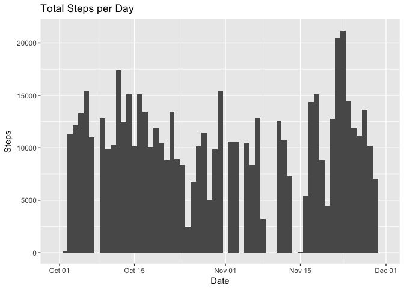
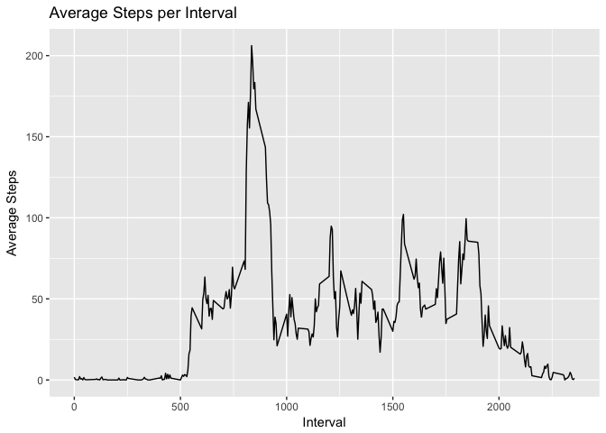
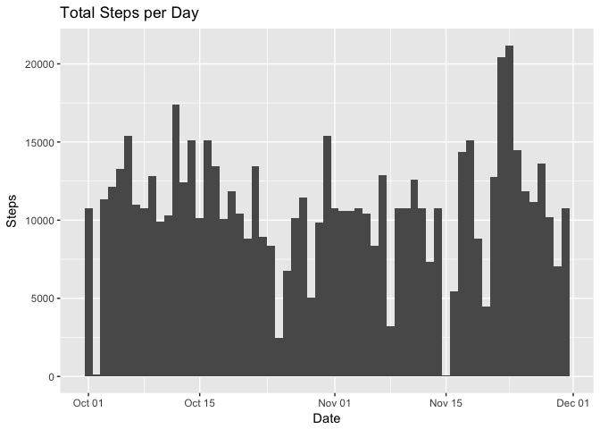
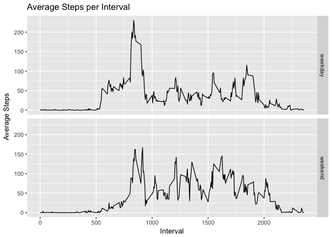

## Loading and preprocessing the data

```r
library(dplyr, warn.conflicts = FALSE)
```

```
## Warning: package 'dplyr' was built under R version 3.4.2
```

```r
library(ggplot2)
stepData <-data <- read.csv("activity.csv")
##daily totals
dailySteps <- stepData %>% 
    group_by(date) %>% 
    summarize(stepTotal = sum(steps))
dailySteps$date <- as.Date(dailySteps$date, "%Y-%m-%d")   
##average per range (no imputed values)
rangeAvg <- stepData %>% 
    group_by(interval) %>% 
    summarize(stepAvg = mean(steps, na.rm=TRUE))
```

## What is mean total number of steps taken per day?
Here is a histogram of the daily total steps:

```r
histDaily <- (ggplot(dailySteps, aes(x=date, weight=stepTotal))
    + geom_histogram(binwidth =1)
    + labs(title ="Total Steps per Day", x = "Date", y = "Steps"))
print(histDaily)
```

<!-- -->


```r
options(scipen=999)
dailyMean <- mean(dailySteps$stepTotal, na.rm=TRUE)
dailyMedian <- median(dailySteps$stepTotal, na.rm=TRUE)
```

The mean total number number of steps per day is 10766.1886792.
The median totoal number of steps per day is 10765.

## What is the average daily activity pattern?

```r
lineInterval <- (ggplot(rangeAvg,aes(x=interval, y=stepAvg))
                 + geom_line()
                 + labs(title ="Average Steps per Interval", 
                        x = "Interval", y = "Average Steps"))
print(lineInterval)
```

<!-- -->


```r
maxInterval <- rangeAvg[which.max(rangeAvg$stepAvg),]$interval
```

On average, the most steps were taken in the 835 five minute time interval.

## Imputing missing values

```r
totalNA <- sum(is.na(stepData$steps))
```

There are a total of 2304 missing values in the dataset. 


```r
##set all NA values to the average for that interval
stepDataNoNA <-stepData
for(i in seq_along(stepData$steps)){
    if (is.na(stepData[i,"steps"])) {
        currInterval <- stepData[i,]$interval
        whichRange <- which(rangeAvg$interval == currInterval)
        stepDataNoNA[i,]$steps<-rangeAvg[whichRange,]$stepAvg
    }
}
```


```r
##daily totals after imputing values
dailyStepsNoNA <- stepDataNoNA %>% 
    group_by(date) %>% 
    summarize(stepTotal = sum(steps))
dailyStepsNoNA$date <- as.Date(dailyStepsNoNA$date, "%Y-%m-%d") 
```

Here is a histogram of the daily total steps after imputing missing values:

```r
histDailyNoNA <- (ggplot(dailyStepsNoNA, aes(x=date, weight=stepTotal))
    + geom_histogram(binwidth =1)
    + labs(title ="Total Steps per Day", x = "Date", y = "Steps"))
print(histDailyNoNA)
```

<!-- -->


```r
options(scipen=999)
dailyMeanNoNA <- mean(dailyStepsNoNA$stepTotal, na.rm=TRUE)
dailyMedianNoNA <- median(dailyStepsNoNA$stepTotal, na.rm=TRUE)
```

The mean total number number of steps per day after imputing missing values is 10766.1886792.
The median totoal number of steps per day after imputing missing values is 10766.1886792.

Imputing missing values did not change the mean, but did slightly increase the median. However, the overall total number of steps over the 61 days did increase, as seen in the histogram.

## Are there differences in activity patterns between weekdays and weekends?

```r
##foctor weekends
weekdayYN <- vector(length=length(stepDataNoNA$steps))
for(i in seq_along(stepDataNoNA$steps)){
    weekdayYN[i] <- if (weekdays(as.Date(stepDataNoNA[i,]$date,"%Y-%m-%d"))== "Saturday") {
            "weekend"
        } else if (weekdays(as.Date(stepDataNoNA[i,]$date,"%Y-%m-%d")) == "Sunday") {
            "weekend"
        } else {
            "weekday"
        }
}
##factor(weekdayYN,levels = c(0,1),labels = c("weekend","weekday"))
factor(weekdayYN,levels = c("weekend","weekday"))
stepDataNoNA <- cbind(stepDataNoNA,weekdayYN)
```


```r
##summarize by weekday(end) and interval
rangeAvgWeekdayYN <- stepDataNoNA %>% 
    group_by(weekdayYN, interval) %>% 
    summarize(stepAvg = mean(steps, na.rm=TRUE))

##plot weekday vs weekend
lineInterval <- (ggplot(rangeAvgWeekdayYN,aes(x=interval, y=stepAvg))
                 + geom_line()
                 + facet_grid(weekdayYN~.)
                 + labs(title ="Average Steps per Interval", 
                        x = "Interval", y = "Average Steps"))
print(lineInterval)
```

<!-- -->
